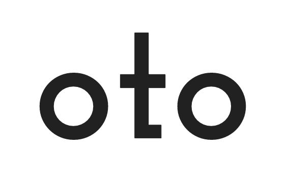

Go driven rpc code generation tool for right now.

- 100% Go
- Describe services with Go interfaces
- Generate server and client code
- Modify the templates to solve your particular needs

## Tutorial

Install the project:

```
go install github.com/pacedotdev/oto
```

Create a project folder, and write your service definition as a Go interface:

```go
// definitions/definitons.go
package definitions

type GreeterService interface {
    Greet(GreetRequest) GreetResponse
}

type GreetRequest struct {
    Name string
}

type GreetResponse struct {
    Greeting string
}
```

Download templates from otohttp

```bash
mkdir templates \
    && wget https://raw.githubusercontent.com/pacedotdev/oto/master/otohttp/templates/server.go.plush -q -O ./templates/server.go.plush \
    && wget https://raw.githubusercontent.com/pacedotdev/oto/master/otohttp/templates/client.js.plush -q -O ./templates/client.js.plush
```

Use the `oto` tool to generate a client and server:

```bash
mkdir generated &&
oto -template ./templates/server.go.plush \
    -out ./generated/oto.gen.go \
    -ignore Ignorer \
    -pkg generated \
    ./definitions/definitions.go &&
gofmt -w ./generated/oto.gen.go ./generated/oto.gen.go &&
oto -template ./templates/client.js.plush \
    -out ./generated/oto.gen.js \
    -ignore Ignorer \
    ./definitions/definitions.go
```

- Run `oto -help` for more information about these flags

Implement the service in Go:

```go
// greeter_service.go
package main

type GreeterService struct{}

func (GreeterService) Greet(ctx context.Context, r GreetRequest) (*GreetResponse, error) {
    resp := &GreetResponse{
        Greeting: "Hello " + r.Name,
    }
    return resp, nil
}
```

Use the generated Go code to write a `main.go` that exposes the server:

```go
// main.go
package main

func main() {
    g := GreeterService{}
    server := otohttp.NewServer()
    generated.RegisterGreeterService(server, g)
    http.Handle("/oto/", server)
    log.Fatal(http.ListenAndServe(":8080", nil))
}
```

Use the generated client to access the service in JavaScript:

```javascript
import { GreeterService } from "oto.gen.js";

const greeterService = new GreeterService();

greeterService
    .greet({
        name: "Mat"
    })
    .then(response => alert(response.greeting))
    .catch(e => alert(e));
```

### Specifying additional template data

You can provide strings to your templates via the `-params` flag:

```bash
oto \
    -template ./templates/server.go.plush \
    -out ./generated/oto.gen.go \
    -params "key1:value1,key2:value2" \
    ./definitions/definitions.go
```

Within your templates, you may access these strings with `<%= params["key1"] %>`.


